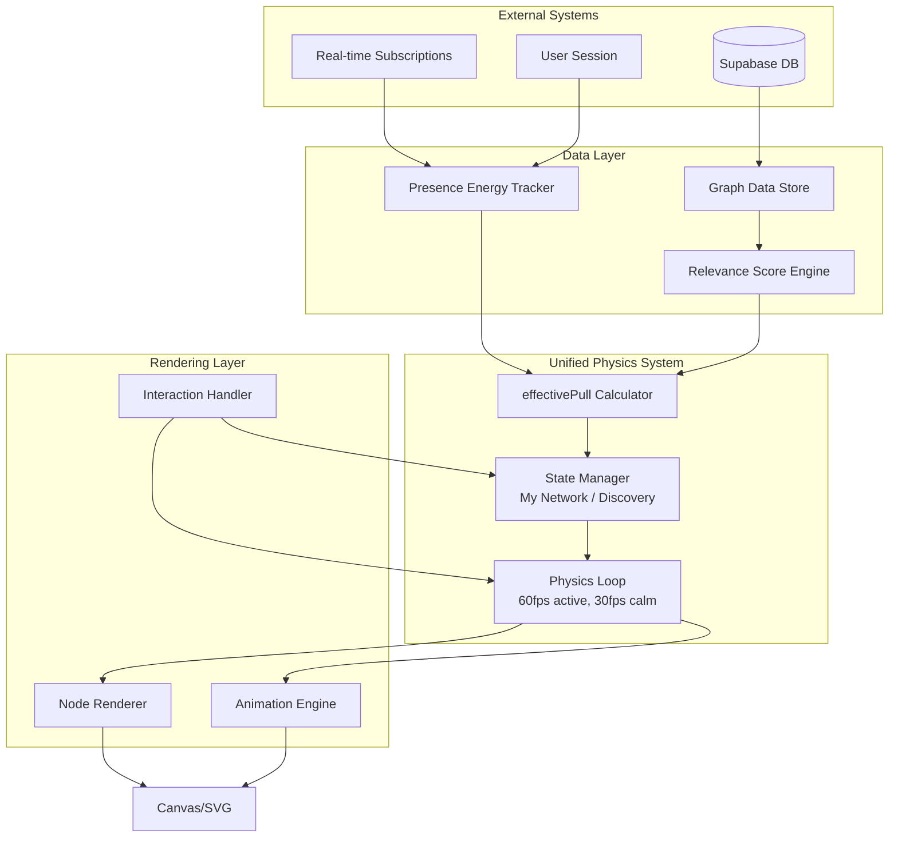

# Design Document: Unified Network Discovery

## Overview

This design transforms the existing "My Network" and "Discovery" views into a unified physics-driven system where discovery emerges naturally based on context, momentum, and real-time presence. The system eliminates explicit mode selection in favor of dynamic state transitions, where presence affects physics structurally rather than decoratively.

### Core Philosophy

"Presence determines when Discovery appears; relevance determines what appears."

The system treats nodes as actors with physical properties that respond to relevance and presence. All motion has purpose, and the graph naturally settles into calm states between interactions.

### Key Design Principles

1. **Single Physics Loop**: One unified animation system governs all node behavior
2. **effectivePull as Universal Metric**: All node behavior derives from `effectivePull = relevanceScore × (1 + presenceEnergy)`
3. **State as Emergence**: My Network and Discovery are emergent states, not modes
4. **Presence as Structure**: Presence affects physics (position, velocity, glow), not UI (badges, labels)
5. **Motion Resolves to Calm**: All animations settle to stillness within 15 seconds

## Architecture

### System Components




### Component Responsibilities

**Physics Loop**
- Runs at 60fps during active interaction, 30fps during calm state
- Updates node positions based on D3 force simulation
- Applies effectivePull-based modifications to forces
- Triggers rendering updates
- Manages animation frame scheduling via requestAnimationFrame

**State Manager**
- Tracks current state (My Network, Discovery, Transitioning)
- Detects state transition triggers (momentum, presence, user action)
- Manages node visibility and introduction timing
- Enforces limits (max 3 guided nodes, max 1 presence-amplified)
- Coordinates smooth state transitions

**effectivePull Calculator**
- Computes `effectivePull = relevanceScore × (1 + presenceEnergy)` for each node
- Categorizes nodes by effectivePull thresholds
- Updates when relevanceScore or presenceEnergy changes
- Provides node behavior classification (static, drifting, actionable)

**Relevance Score Engine**
- Computes persistent relevanceScore [0, 1] based on:
  - Connection history (0.15 weight)
  - Shared projects (0.3 weight)
  - Shared themes (0.2 weight)
  - Interaction frequency (0.15 weight)
  - Temporal opportunities (0.2 weight)
- Recalculates on graph changes
- Normalizes scores to [0, 1] range

**Presence Energy Tracker**
- Tracks ephemeral presenceEnergy [0, 1] per node
- Updates based on real-time session activity
- Applies TTL-based decay
- Subscribes to Supabase real-time events
- Manages presence tiers (Ambient, Relevant, Actionable)


**Graph Data Store**
- Maintains node and edge data structures
- Integrates with existing Supabase schema (community, connections, projects, themes)
- Provides query interface for node relationships
- Caches computed values (relevanceScore, effectivePull)
- Handles data synchronization

**Node Renderer**
- Renders nodes with position, size, color, glow
- Applies distance-based dimming for focused nodes
- Uses CSS transforms for GPU acceleration
- Implements spatial culling for off-screen nodes
- Manages visual state (normal, focused, guided)

**Animation Engine**
- Handles smooth transitions (position, scale, opacity)
- Uses cubic-bezier easing (0.4, 0.0, 0.2, 1)
- Staggers simultaneous animations (100ms offset)
- Manages glow pulse animations
- Coordinates fade in/out for discovery nodes

**Interaction Handler**
- Processes tap/click events on nodes
- Provides haptic feedback (mobile)
- Ensures 44x44px minimum tap targets
- Routes actions to appropriate handlers
- Manages thumb-reachable positioning (mobile)

## Components and Interfaces

### Core Data Structures

#### Node

```typescript
interface Node {
  id: string;
  type: 'person' | 'project' | 'theme' | 'organization';
  name: string;
  imageUrl?: string;
  
  // Physics properties (managed by D3)
  x: number;
  y: number;
  vx: number;  // velocity x
  vy: number;  // velocity y
  fx?: number; // fixed x (optional)
  fy?: number; // fixed y (optional)
  
  // Computed properties
  relevanceScore: number;      // [0, 1] persistent
  presenceEnergy: number;      // [0, 1] ephemeral
  effectivePull: number;       // computed from above
  
  // State flags
  isMyNetwork: boolean;        // existing connection
  isDiscovery: boolean;        // discovery candidate
  isFocused: boolean;          // currently focused
  isGuided: boolean;           // high effectivePull, in actionable proximity
  
  // Metadata
  lastInteraction?: Date;
  presenceTTL?: Date;
  sharedThemes: string[];
  sharedProjects: string[];
}
```


#### Edge

```typescript
interface Edge {
  source: string | Node;  // node id or reference
  target: string | Node;  // node id or reference
  type: 'connection' | 'project' | 'theme';
  strength: number;       // [0, 1] affects link distance
  createdAt: Date;
}
```

#### SystemState

```typescript
interface SystemState {
  mode: 'my-network' | 'discovery' | 'transitioning';
  currentFocusedNodeId: string | null;
  isDefaultUserFocus: boolean;
  
  // Discovery state
  guidedNodes: string[];           // max 3
  presenceAmplifiedNode: string | null;  // max 1
  
  // Motion tracking
  lastInteractionTime: Date;
  averageVelocity: number;
  isCalm: boolean;
  
  // Performance
  fps: 60 | 30;
  visibleNodeCount: number;
}
```

#### PresenceTier

```typescript
enum PresenceTier {
  None = 0,      // presenceEnergy = 0
  Ambient = 1,   // presenceEnergy 0.1-0.3
  Relevant = 2,  // presenceEnergy 0.3-0.6
  Actionable = 3 // presenceEnergy 0.6-1.0
}
```

### API Interfaces

#### UnifiedNetworkAPI

```typescript
interface UnifiedNetworkAPI {
  // Initialization
  initialize(containerId: string, userId: string): Promise<void>;
  destroy(): void;
  
  // State queries
  getState(): SystemState;
  getNode(nodeId: string): Node | null;
  getAllNodes(): Node[];
  
  // Focus and navigation
  focusNode(nodeId: string, options?: FocusOptions): void;
  centerOnCurrentUser(): void;
  resetToMyNetwork(): void;
  
  // Discovery control
  triggerDiscovery(): void;
  dismissGuidedNode(nodeId: string): void;
  
  // Presence management
  updatePresence(nodeId: string, energy: number, ttl?: number): void;
  clearPresence(nodeId: string): void;
  
  // Events
  on(event: string, handler: Function): void;
  off(event: string, handler: Function): void;
}
```


#### RelevanceScoreEngine

```typescript
interface RelevanceScoreEngine {
  computeScore(userId: string, targetNodeId: string): number;
  recalculateAll(userId: string): Promise<void>;
  getSharedThemes(userId: string, targetId: string): string[];
  getSharedProjects(userId: string, targetId: string): string[];
  getInteractionHistory(userId: string, targetId: string): InteractionRecord[];
}
```

#### PresenceEnergyTracker

```typescript
interface PresenceEnergyTracker {
  subscribe(userId: string): void;
  unsubscribe(): void;
  getEnergy(nodeId: string): number;
  setEnergy(nodeId: string, energy: number, ttl?: number): void;
  decay(nodeId: string, rate: number): void;
  getTier(nodeId: string): PresenceTier;
}
```

## Data Models

### Database Schema Extensions

The system integrates with existing Supabase tables and adds new tracking tables:

#### New Table: `presence_sessions`

```sql
CREATE TABLE presence_sessions (
  id UUID PRIMARY KEY DEFAULT uuid_generate_v4(),
  user_id UUID REFERENCES community(id) ON DELETE CASCADE,
  context_type TEXT NOT NULL, -- 'theme', 'project', 'profile'
  context_id UUID NOT NULL,
  energy DECIMAL(3,2) NOT NULL CHECK (energy >= 0 AND energy <= 1),
  expires_at TIMESTAMPTZ NOT NULL,
  created_at TIMESTAMPTZ DEFAULT NOW(),
  updated_at TIMESTAMPTZ DEFAULT NOW()
);

CREATE INDEX idx_presence_active ON presence_sessions(user_id, expires_at) 
  WHERE expires_at > NOW();
CREATE INDEX idx_presence_context ON presence_sessions(context_type, context_id);
```

#### New Table: `node_interactions`

```sql
CREATE TABLE node_interactions (
  id UUID PRIMARY KEY DEFAULT uuid_generate_v4(),
  user_id UUID REFERENCES community(id) ON DELETE CASCADE,
  node_id UUID NOT NULL,
  node_type TEXT NOT NULL, -- 'person', 'project', 'theme', 'organization'
  interaction_type TEXT NOT NULL, -- 'view', 'tap', 'connect', 'dismiss'
  created_at TIMESTAMPTZ DEFAULT NOW()
);

CREATE INDEX idx_interactions_user ON node_interactions(user_id, created_at DESC);
CREATE INDEX idx_interactions_node ON node_interactions(node_id, created_at DESC);
```


#### New Table: `discovery_dismissals`

```sql
CREATE TABLE discovery_dismissals (
  id UUID PRIMARY KEY DEFAULT uuid_generate_v4(),
  user_id UUID REFERENCES community(id) ON DELETE CASCADE,
  node_id UUID NOT NULL,
  dismissed_at TIMESTAMPTZ DEFAULT NOW(),
  reintroduce_after TIMESTAMPTZ NOT NULL, -- dismissed_at + 24 hours
  
  UNIQUE(user_id, node_id)
);

CREATE INDEX idx_dismissals_reintroduce ON discovery_dismissals(user_id, reintroduce_after);
```

### Computed Values

#### Relevance Score Calculation

```typescript
function computeRelevanceScore(
  userId: string, 
  targetNodeId: string,
  data: GraphData
): number {
  let score = 0;
  
  // Connection history (0.15 weight)
  const hasInteractedRecently = data.interactions
    .filter(i => i.userId === userId && i.nodeId === targetNodeId)
    .some(i => (Date.now() - i.createdAt.getTime()) < 7 * 24 * 60 * 60 * 1000);
  if (hasInteractedRecently) score += 0.15;
  
  // Shared projects (0.3 weight)
  const sharedProjects = getSharedProjects(userId, targetNodeId, data);
  if (sharedProjects.length >= 1) score += 0.3;
  
  // Shared themes (0.2 weight)
  const sharedThemes = getSharedThemes(userId, targetNodeId, data);
  if (sharedThemes.length >= 2) score += 0.2;
  else if (sharedThemes.length === 1) score += 0.1;
  
  // Interaction frequency (0.15 weight)
  const interactionCount = data.interactions
    .filter(i => i.userId === userId && i.nodeId === targetNodeId)
    .length;
  if (interactionCount >= 5) score += 0.15;
  else if (interactionCount >= 2) score += 0.08;
  
  // Temporal opportunities (0.2 weight)
  const hasTemporalOpportunity = checkTemporalOpportunity(targetNodeId, data);
  if (hasTemporalOpportunity) score += 0.2;
  
  // Normalize to [0, 1]
  return Math.min(1.0, score);
}
```


#### effectivePull Calculation

```typescript
function computeEffectivePull(node: Node): number {
  return node.relevanceScore * (1 + node.presenceEnergy);
}

function categorizeNode(effectivePull: number): NodeCategory {
  if (effectivePull < 0.3) return 'static';
  if (effectivePull < 0.6) return 'drifting';
  if (effectivePull < 0.9) return 'actionable';
  return 'priority';
}
```

#### Presence Energy Decay

```typescript
function decayPresenceEnergy(node: Node, deltaTime: number): void {
  if (!node.presenceTTL) return;
  
  const now = Date.now();
  const ttl = node.presenceTTL.getTime();
  
  if (now >= ttl) {
    // TTL expired, decay to 0 over 2 seconds
    const decayRate = 0.5 / 1000; // 0.5 per second
    node.presenceEnergy = Math.max(0, node.presenceEnergy - (decayRate * deltaTime));
    
    if (node.presenceEnergy === 0) {
      node.presenceTTL = undefined;
    }
  }
}
```

### State Transition Logic

#### My Network → Discovery Transition

```typescript
function shouldTransitionToDiscovery(state: SystemState, nodes: Node[]): boolean {
  // Check momentum
  const hasLowMomentum = state.averageVelocity < 0.1 && 
    (Date.now() - state.lastInteractionTime.getTime()) > 5000;
  
  // Check for strong next action
  const hasStrongNextAction = nodes.some(n => n.effectivePull > 0.7);
  
  // Check for relevant presence
  const hasRelevantPresence = nodes.some(n => 
    !n.isMyNetwork && n.presenceEnergy > 0.6
  );
  
  // Check temporal opportunities
  const hasTemporalOpportunity = nodes.some(n => 
    !n.isMyNetwork && hasTemporalFlag(n)
  );
  
  return (hasLowMomentum || !hasStrongNextAction) && 
         (hasRelevantPresence || hasTemporalOpportunity);
}
```


#### Discovery → My Network Transition

```typescript
function shouldTransitionToMyNetwork(state: SystemState, nodes: Node[]): boolean {
  // User interaction resets to My Network
  const recentInteraction = (Date.now() - state.lastInteractionTime.getTime()) < 3000;
  
  // All guided nodes faded
  const allGuidedNodesFaded = state.guidedNodes.every(id => {
    const node = nodes.find(n => n.id === id);
    return !node || node.effectivePull < 0.3;
  });
  
  // No presence energy
  const noPresenceEnergy = nodes.every(n => n.presenceEnergy === 0);
  
  return recentInteraction || (allGuidedNodesFaded && noPresenceEnergy);
}
```

### Physics Modifications

#### Force Adjustments Based on effectivePull

```typescript
function applyEffectivePullForces(simulation: d3.ForceSimulation, nodes: Node[]): void {
  // Modify link strength based on effectivePull
  simulation.force('link')
    .strength((link: Edge) => {
      const source = nodes.find(n => n.id === link.source);
      const target = nodes.find(n => n.id === link.target);
      if (!source || !target) return 0.1;
      
      const avgPull = (source.effectivePull + target.effectivePull) / 2;
      return 0.1 + (avgPull * 0.4); // range [0.1, 0.5]
    });
  
  // Apply radial force for guided nodes (pull toward center)
  const guidedForce = d3.forceRadial()
    .radius((node: Node) => {
      if (node.isGuided) return 150; // thumb-reachable distance
      return 0;
    })
    .strength((node: Node) => {
      if (node.isGuided) return node.effectivePull * 0.3;
      return 0;
    });
  
  simulation.force('guided', guidedForce);
  
  // Apply charge force based on effectivePull
  simulation.force('charge')
    .strength((node: Node) => {
      if (node.effectivePull < 0.3) return -30; // weak repulsion
      if (node.effectivePull < 0.6) return -50; // medium repulsion
      return -80; // strong repulsion for actionable nodes
    });
}
```


### Rendering and Animation

#### Node Visual States

```typescript
function getNodeVisualState(node: Node, state: SystemState): VisualState {
  const baseRadius = 20;
  const baseOpacity = 1.0;
  
  // Determine glow based on presence tier
  let glowIntensity = 0;
  let glowColor = '#ffffff';
  
  if (node.presenceEnergy >= 0.6) {
    // Actionable tier
    glowIntensity = 0.8;
    glowColor = '#00ffff';
  } else if (node.presenceEnergy >= 0.3) {
    // Relevant tier
    glowIntensity = 0.5;
    glowColor = '#4488ff';
  } else if (node.presenceEnergy >= 0.1) {
    // Ambient tier
    glowIntensity = 0.3;
    glowColor = '#6666ff';
  }
  
  // Apply dimming if another node is focused
  let opacity = baseOpacity;
  if (state.currentFocusedNodeId && state.currentFocusedNodeId !== node.id) {
    const focusedNode = getNode(state.currentFocusedNodeId);
    if (focusedNode) {
      const distance = Math.hypot(node.x - focusedNode.x, node.y - focusedNode.y);
      const maxDistance = 500;
      const dimFactor = Math.min(1, distance / maxDistance);
      opacity = 0.3 + (0.7 * (1 - dimFactor));
    }
  }
  
  // Scale based on effectivePull
  const scale = 1.0 + (node.effectivePull * 0.5); // range [1.0, 1.5]
  
  return {
    radius: baseRadius * scale,
    opacity,
    glowIntensity,
    glowColor,
    scale
  };
}
```

#### Animation Timing

```typescript
const ANIMATION_TIMINGS = {
  // State transitions
  discoveryFadeIn: 1500,      // ms
  discoveryFadeOut: 2000,     // ms
  myNetworkRecenter: 1000,    // ms
  
  // Node animations
  positionTransition: 1000,   // ms
  glowPulse: 2000,           // ms (one cycle)
  presenceDecay: 2000,       // ms (full decay)
  
  // Interaction feedback
  tapResponse: 50,           // ms (haptic)
  focusTransition: 750,      // ms
  
  // Performance
  calmStateDelay: 10000,     // ms (enter calm after this)
  motionSettleTime: 15000,   // ms (max time to settle)
  
  // Discovery timing
  guidedNodeStagger: 100,    // ms (between multiple guided nodes)
  dismissalCooldown: 86400000 // ms (24 hours)
};
```


#### Easing Functions

```typescript
// Cubic-out easing for smooth deceleration
function cubicOut(t: number): number {
  const f = t - 1;
  return f * f * f + 1;
}

// Apply easing to position transitions
function animatePosition(
  node: Node, 
  targetX: number, 
  targetY: number, 
  duration: number
): void {
  const startX = node.x;
  const startY = node.y;
  const startTime = performance.now();
  
  function step(currentTime: number) {
    const elapsed = currentTime - startTime;
    const progress = Math.min(1, elapsed / duration);
    const eased = cubicOut(progress);
    
    node.x = startX + (targetX - startX) * eased;
    node.y = startY + (targetY - startY) * eased;
    
    if (progress < 1) {
      requestAnimationFrame(step);
    }
  }
  
  requestAnimationFrame(step);
}
```

### Mobile-First Considerations

#### Thumb-Reachable Zones

```typescript
function getThumbReachableZone(viewportHeight: number): Rectangle {
  // Bottom 60% of screen is thumb-reachable
  const reachableHeight = viewportHeight * 0.6;
  const topBoundary = viewportHeight - reachableHeight;
  
  return {
    top: topBoundary,
    bottom: viewportHeight,
    left: 0,
    right: window.innerWidth
  };
}

function positionGuidedNode(node: Node, viewport: Viewport): void {
  const zone = getThumbReachableZone(viewport.height);
  const centerX = viewport.width / 2;
  const centerY = zone.top + (zone.bottom - zone.top) / 2;
  
  // Position within thumb-reachable zone
  node.fx = centerX + (Math.random() - 0.5) * 100;
  node.fy = centerY + (Math.random() - 0.5) * 100;
}
```


#### Touch Interaction

```typescript
function handleNodeTap(node: Node, event: TouchEvent): void {
  // Ensure minimum tap target size
  const MIN_TAP_SIZE = 44; // pixels
  const nodeRadius = getNodeVisualState(node).radius;
  const effectiveRadius = Math.max(MIN_TAP_SIZE / 2, nodeRadius);
  
  // Check if tap is within effective radius
  const touch = event.touches[0];
  const dx = touch.clientX - node.x;
  const dy = touch.clientY - node.y;
  const distance = Math.hypot(dx, dy);
  
  if (distance <= effectiveRadius) {
    // Provide haptic feedback
    if ('vibrate' in navigator) {
      navigator.vibrate(50);
    }
    
    // Handle tap action
    handleNodeAction(node);
  }
}
```

### Performance Optimizations

#### Spatial Culling

```typescript
function cullOffscreenNodes(nodes: Node[], viewport: Viewport): Node[] {
  const margin = 100; // pixels outside viewport
  
  return nodes.filter(node => {
    return node.x >= -margin &&
           node.x <= viewport.width + margin &&
           node.y >= -margin &&
           node.y <= viewport.height + margin;
  });
}

function updatePhysics(deltaTime: number): void {
  const visibleNodes = cullOffscreenNodes(allNodes, viewport);
  
  // Only update physics for visible nodes
  visibleNodes.forEach(node => {
    updateNodePhysics(node, deltaTime);
  });
  
  // Update state
  systemState.visibleNodeCount = visibleNodes.length;
}
```

#### Frame Rate Management

```typescript
function manageFrameRate(state: SystemState): void {
  const shouldBeCalm = state.isCalm && 
    (Date.now() - state.lastInteractionTime.getTime()) > 10000;
  
  const targetFPS = shouldBeCalm ? 30 : 60;
  
  if (state.fps !== targetFPS) {
    state.fps = targetFPS;
    adjustAnimationLoop(targetFPS);
  }
}

function adjustAnimationLoop(targetFPS: number): void {
  const frameInterval = 1000 / targetFPS;
  let lastFrameTime = performance.now();
  
  function loop(currentTime: number) {
    const elapsed = currentTime - lastFrameTime;
    
    if (elapsed >= frameInterval) {
      lastFrameTime = currentTime - (elapsed % frameInterval);
      updateFrame();
    }
    
    requestAnimationFrame(loop);
  }
  
  requestAnimationFrame(loop);
}
```


#### GPU Acceleration

```typescript
function renderNode(node: Node, context: CanvasRenderingContext2D): void {
  // Use CSS transforms for position (GPU accelerated)
  const element = document.getElementById(`node-${node.id}`);
  if (element) {
    element.style.transform = `translate(${node.x}px, ${node.y}px) scale(${node.scale})`;
    element.style.opacity = node.opacity.toString();
  }
  
  // Batch DOM updates
  requestAnimationFrame(() => {
    applyBatchedUpdates();
  });
}

function applyBatchedUpdates(): void {
  // Collect all pending updates
  const updates = pendingUpdates.splice(0);
  
  // Apply in single reflow
  updates.forEach(update => {
    update.element.style.cssText = update.styles;
  });
}
```

## Correctness Properties

*A property is a characteristic or behavior that should hold true across all valid executions of a system—essentially, a formal statement about what the system should do. Properties serve as the bridge between human-readable specifications and machine-verifiable correctness guarantees.*


### Property Reflection

After analyzing all acceptance criteria, several properties can be consolidated:

**Redundancies Identified:**
- Properties 1.2, 1.3, 1.4 (node behavior by effectivePull range) can be combined into one comprehensive property
- Properties 4.1, 4.2, 4.3 (presence tier rendering) can be combined into one property about presence-based physics
- Properties 5.2, 5.3, 5.4 (relevanceScore components) are subsumed by 5.1 (overall computation)
- Properties 7.1, 7.2 (guided node decay) can be combined into one decay property
- Properties 14.1, 14.2 (state transition timing) are specific examples, not general properties
- Properties 15.1, 15.2, 15.3 (frame rate management) can be combined into one adaptive frame rate property

**Consolidated Properties:**
The following properties provide unique validation value after consolidation:


### Core Properties

**Property 1: effectivePull Computation**

*For any* node in the system, the effectivePull value should equal relevanceScore × (1 + presenceEnergy), and this value should determine the node's behavior category (static < 0.3, drifting 0.3-0.6, actionable 0.6-0.9, priority ≥ 0.9).

**Validates: Requirements 1.1, 1.2, 1.3, 1.4**

**Property 2: Node Motion Resolution**

*For any* node that enters actionable proximity (effectivePull ≥ 0.6), after completing its pulse animation, the node's velocity should decay to near-zero (< 0.05) and remain stable until the next interaction or state change.

**Validates: Requirements 1.5, 11.1, 11.5**

**Property 3: My Network State Visibility**

*For any* system state where mode = 'my-network', only nodes with isMyNetwork = true should be rendered, and all discovery nodes should have opacity = 0 or be excluded from the render list.

**Validates: Requirements 2.2**

**Property 4: Ambient Motion Constraint**

*For any* system state where mode = 'my-network' and isCalm = true, the average velocity of all nodes should be below 0.1, ensuring minimal motion.

**Validates: Requirements 2.3**

**Property 5: Presence-Based Glow**

*For any* node with presenceEnergy > 0, the glow intensity should be proportional to presenceEnergy (Ambient tier: 0.3, Relevant tier: 0.5, Actionable tier: 0.8), and nodes with presenceEnergy = 0 should have glowIntensity = 0.

**Validates: Requirements 2.4, 2.5, 4.1, 4.2, 4.3**

**Property 6: Discovery Node Limit**

*For any* system state where mode = 'discovery', the count of nodes with isGuided = true should be ≤ 3, and the count of nodes with presenceEnergy > 0.8 should be ≤ 1.

**Validates: Requirements 3.6, 3.7**


**Property 7: Discovery Node Spatial Integration**

*For any* discovery node introduced during Discovery_State, the node's initial position should be within the same coordinate space as My_Network nodes (not in a separate layer or offset region), and temporary physics forces should guide it into the visible viewport.

**Validates: Requirements 3.4, 3.5**

**Property 8: Presence Physics Expression**

*For any* node, presence tier should be expressed only through physics properties (position, velocity, glowIntensity, glowColor) and never through UI elements (badges, labels, status indicators), meaning no DOM elements with class names like "badge", "status", or "online-indicator" should exist for presence visualization.

**Validates: Requirements 4.4**

**Property 9: Presence Energy Decay**

*For any* node where presenceEnergy > 0 and presenceTTL has expired, the presenceEnergy value should decay linearly to 0 over exactly 2 seconds (decay rate = 0.5 per second).

**Validates: Requirements 4.5, 7.4**

**Property 10: Relevance Score Normalization**

*For any* node, the relevanceScore value should always be in the range [0, 1], regardless of how many scoring factors apply (connection history, shared projects, shared themes, interaction frequency, temporal opportunities).

**Validates: Requirements 5.1, 5.5**

**Property 11: Relevance Score Reactivity**

*For any* change to user interactions, projects, or themes, the relevanceScore for affected nodes should be recalculated within one physics loop iteration (< 17ms at 60fps).

**Validates: Requirements 5.6**

**Property 12: Shared Theme Scoring**

*For any* pair of users sharing N themes, if N ≥ 2, the relevanceScore contribution should be +0.2; if N = 1, the contribution should be +0.1; if N = 0, the contribution should be 0.

**Validates: Requirements 5.2**


**Property 13: Shared Project Scoring**

*For any* pair of users sharing N projects, if N ≥ 1, the relevanceScore contribution should be +0.3; if N = 0, the contribution should be 0.

**Validates: Requirements 5.3**

**Property 14: Recent Interaction Scoring**

*For any* node that has been interacted with in the past 7 days, the relevanceScore contribution should be +0.15; otherwise, the contribution should be 0.

**Validates: Requirements 5.4**

**Property 15: Action Presentation**

*For any* guided node that is tapped, the system should present exactly one concrete action (connect, join project, or explore theme) based on the node type and current relationship state.

**Validates: Requirements 6.1**

**Property 16: Graph Update on Action**

*For any* completed action on a guided node, the graph data (nodes, edges, or node properties) should be updated to reflect the new state, and this update should be visible in the next render frame.

**Validates: Requirements 6.2**

**Property 17: Connection State Transition**

*For any* node where a new connection is established, the node's isMyNetwork flag should be set to true, isDiscovery should be set to false, and a smooth position transition (duration ≥ 750ms) should be initiated.

**Validates: Requirements 6.3**

**Property 18: Project Join Position Update**

*For any* node representing a project that a user joins, the node's position should be recalculated based on the new relationship graph, and the position should change by at least 10 pixels (indicating visible movement).

**Validates: Requirements 6.4**


**Property 19: Theme Exploration Visual Update**

*For any* node representing a theme that a user explores, both the glowIntensity and position should change within one animation frame, with glowIntensity increasing by at least 0.1 and position shifting based on the new context.

**Validates: Requirements 6.5**

**Property 20: Guided Node Decay**

*For any* guided node that is not interacted with for 30+ seconds, the effectivePull should decrease at a rate of 0.1 per second, and when effectivePull falls below 0.3, the node should fade to background over 2 seconds (opacity transition from current to 0.3).

**Validates: Requirements 7.1, 7.2**

**Property 21: Dismissal Cooldown**

*For any* guided node that is dismissed, the node should not be reintroduced as a guided node within 24 hours unless either presenceEnergy or relevanceScore increases by more than 0.3 from the dismissal time values.

**Validates: Requirements 7.5**

**Property 22: Thumb-Reachable Positioning**

*For any* node entering actionable proximity on a mobile viewport, the node's y-coordinate should be positioned within the bottom 60% of the viewport height (y ≥ viewportHeight × 0.4).

**Validates: Requirements 8.1**

**Property 23: Actionable Proximity Prioritization**

*For any* set of nodes competing for actionable proximity (multiple nodes with effectivePull ≥ 0.6), the node with the highest effectivePull value should be selected for positioning in the thumb-reachable zone.

**Validates: Requirements 8.2**

**Property 24: Minimum Tap Target Size**

*For any* interactive node, the effective tap target area should be at least 44×44 pixels, either through the node's visual radius or through an invisible hit area expansion.

**Validates: Requirements 8.3**


**Property 25: Session-Based Presence**

*For any* node's presenceEnergy value, the value should be computed from current session activity only and should never be loaded from persistent storage (database, localStorage, sessionStorage).

**Validates: Requirements 9.1, 9.3**

**Property 26: Active View Presence**

*For any* user actively viewing a theme or project (view duration > 0 seconds), the presenceEnergy for related nodes should be set to 0.8 for the duration of the view.

**Validates: Requirements 9.4**

**Property 27: Discovery Accessibility**

*For any* authenticated user (regardless of admin status), the Discovery_State should be accessible, meaning discovery nodes can appear and be interacted with without permission checks.

**Validates: Requirements 10.1, 10.2**

**Property 28: Dismissal Without Penalty**

*For any* guided node that is dismissed by a user, no negative changes should occur to the user's relevanceScore, presenceEnergy, or connection graph (dismissal should only affect reintroduction timing).

**Validates: Requirements 10.4**

**Property 29: Discovery Frequency Preferences**

*For any* user with configured discovery frequency preferences, the actual rate of Discovery_State transitions should match the preference setting (e.g., if set to "low", transitions should occur at most once per 5 minutes).

**Validates: Requirements 10.5**

**Property 30: Adaptive Discovery Frequency**

*For any* user with fewer than 5 nodes in their connection graph, the frequency of Discovery_State transitions should be higher than for users with ≥ 5 nodes (measured as shorter average time between transitions).

**Validates: Requirements 12.3**


**Property 31: Discovery Rate Limiting**

*For any* sequence of Discovery_State transitions, the minimum time between consecutive transitions should be at least 2 minutes (120 seconds).

**Validates: Requirements 12.5**

**Property 32: Deadline Urgency Presence**

*For any* event or project node with a deadline timestamp within 48 hours of the current time, the presenceEnergy should be increased by 0.5 (capped at 1.0).

**Validates: Requirements 13.1**

**Property 33: Collaborative Presence**

*For any* connection node where the connected user is actively working on a shared interest (same theme or project), the presenceEnergy for that connection should be increased by 0.4.

**Validates: Requirements 13.2**

**Property 34: Collective Theme Presence**

*For any* theme node with more than 3 participants having presenceEnergy > 0.5, the theme node's own presenceEnergy should be increased by 0.3.

**Validates: Requirements 13.3**

**Property 35: Temporal Priority**

*For any* pair of nodes with effectivePull values within 0.1 of each other, if one node has a temporal opportunity (deadline within 48 hours) and the other does not, the temporal node should be prioritized for guided node selection.

**Validates: Requirements 13.4**

**Property 36: Position Interpolation**

*For any* node whose effectivePull changes, the position transition should use interpolation over 1 second with cubic-bezier easing (0.4, 0.0, 0.2, 1), resulting in smooth deceleration.

**Validates: Requirements 14.3, 14.4**


**Property 37: Animation Staggering**

*For any* set of nodes transitioning simultaneously (same frame), the animations should be staggered with a 100ms delay between each node's animation start time to avoid visual clutter.

**Validates: Requirements 14.5**

**Property 38: Adaptive Frame Rate**

*For any* system state, the physics loop frame rate should be 60fps during active interaction (lastInteractionTime < 10 seconds ago) and 30fps during calm state (lastInteractionTime ≥ 10 seconds ago and isCalm = true).

**Validates: Requirements 15.1, 15.2, 11.3, 11.4**

**Property 39: requestAnimationFrame Usage**

*For any* animation scheduling in the system, the requestAnimationFrame API should be used (not setTimeout or setInterval), ensuring browser-optimized rendering.

**Validates: Requirements 15.4**

**Property 40: GPU-Accelerated Positioning**

*For any* node position update, CSS transform properties (translate, scale) should be used instead of top/left properties, enabling GPU acceleration.

**Validates: Requirements 15.6**

**Property 41: Spatial Culling**

*For any* physics loop iteration where the total node count exceeds 50, nodes positioned outside the viewport bounds (with 100px margin) should be excluded from physics calculations, reducing computational load.

**Validates: Requirements 15.7**

## Error Handling

### Error Categories

**1. Data Loading Errors**
- Supabase connection failures
- Missing or malformed node data
- Invalid relationship data

**Strategy:** Graceful degradation with cached data, user notification, retry mechanism


**2. Physics Simulation Errors**
- NaN or Infinity in position calculations
- Velocity explosion (nodes moving too fast)
- Simulation instability

**Strategy:** Clamp values, reset unstable nodes, log warnings

**3. Presence Tracking Errors**
- Real-time subscription failures
- TTL calculation errors
- Presence data inconsistencies

**Strategy:** Fall back to polling, clear stale presence, continue without presence

**4. Rendering Errors**
- Canvas/SVG rendering failures
- Animation frame drops
- Memory exhaustion

**Strategy:** Reduce node count, disable animations, show simplified view

### Error Handling Patterns

```typescript
// Data loading with fallback
async function loadGraphData(userId: string): Promise<GraphData> {
  try {
    const data = await fetchFromSupabase(userId);
    return data;
  } catch (error) {
    log.error('Failed to load graph data:', error);
    
    // Try cached data
    const cached = getCachedGraphData(userId);
    if (cached) {
      showNotification('Using cached data', 'warning');
      return cached;
    }
    
    // Fall back to minimal data
    showNotification('Unable to load network', 'error');
    return getMinimalGraphData(userId);
  }
}

// Physics value clamping
function clampNodePosition(node: Node, viewport: Viewport): void {
  const margin = 100;
  
  if (!isFinite(node.x) || !isFinite(node.y)) {
    log.warn('Invalid node position, resetting:', node.id);
    node.x = viewport.width / 2;
    node.y = viewport.height / 2;
    node.vx = 0;
    node.vy = 0;
  }
  
  // Clamp to viewport bounds
  node.x = Math.max(-margin, Math.min(viewport.width + margin, node.x));
  node.y = Math.max(-margin, Math.min(viewport.height + margin, node.y));
  
  // Clamp velocity
  const maxVelocity = 10;
  node.vx = Math.max(-maxVelocity, Math.min(maxVelocity, node.vx));
  node.vy = Math.max(-maxVelocity, Math.min(maxVelocity, node.vy));
}

// Presence subscription with retry
function subscribeToPresence(userId: string): void {
  const subscription = supabase
    .channel(`presence:${userId}`)
    .on('presence', { event: 'sync' }, handlePresenceSync)
    .on('presence', { event: 'join' }, handlePresenceJoin)
    .on('presence', { event: 'leave' }, handlePresenceLeave)
    .subscribe((status) => {
      if (status === 'SUBSCRIBED') {
        log.info('Presence subscription active');
      } else if (status === 'CHANNEL_ERROR') {
        log.error('Presence subscription failed, falling back to polling');
        startPresencePolling(userId);
      }
    });
}
```


## Testing Strategy

### Dual Testing Approach

The system requires both unit tests and property-based tests for comprehensive coverage:

**Unit Tests** focus on:
- Specific examples of state transitions
- Edge cases (empty graphs, single nodes, maximum nodes)
- Error conditions (invalid data, network failures)
- Integration points (Supabase queries, D3 simulation)
- UI interactions (tap handling, haptic feedback)

**Property-Based Tests** focus on:
- Universal properties across all inputs (effectivePull computation, relevance scoring)
- Invariants (node limits, value ranges, state consistency)
- Physics behavior (motion decay, position constraints)
- Animation timing (easing functions, stagger delays)

### Property-Based Testing Configuration

**Library Selection:** Use [fast-check](https://github.com/dubzzz/fast-check) for JavaScript/TypeScript property-based testing

**Test Configuration:**
- Minimum 100 iterations per property test
- Each test tagged with feature name and property number
- Tag format: `// Feature: unified-network-discovery, Property N: [property text]`

**Example Property Test:**

```typescript
import fc from 'fast-check';

// Feature: unified-network-discovery, Property 1: effectivePull Computation
test('effectivePull equals relevanceScore × (1 + presenceEnergy)', () => {
  fc.assert(
    fc.property(
      fc.float({ min: 0, max: 1 }), // relevanceScore
      fc.float({ min: 0, max: 1 }), // presenceEnergy
      (relevanceScore, presenceEnergy) => {
        const node = createNode({ relevanceScore, presenceEnergy });
        const expectedPull = relevanceScore * (1 + presenceEnergy);
        
        expect(node.effectivePull).toBeCloseTo(expectedPull, 5);
        
        // Verify behavior category
        if (expectedPull < 0.3) {
          expect(node.behaviorCategory).toBe('static');
        } else if (expectedPull < 0.6) {
          expect(node.behaviorCategory).toBe('drifting');
        } else if (expectedPull < 0.9) {
          expect(node.behaviorCategory).toBe('actionable');
        } else {
          expect(node.behaviorCategory).toBe('priority');
        }
      }
    ),
    { numRuns: 100 }
  );
});
```


### Unit Test Examples

```typescript
// State transition example
test('transitions to My Network after 3 seconds of inactivity', async () => {
  const system = createUnifiedNetwork();
  await system.initialize('container', 'user-123');
  
  // Simulate interaction
  system.handleNodeTap('node-456');
  expect(system.getState().mode).toBe('my-network');
  
  // Wait 3 seconds
  await sleep(3000);
  
  // Should still be in My Network (no discovery triggers)
  expect(system.getState().mode).toBe('my-network');
});

// Edge case: empty graph
test('handles empty connection graph gracefully', async () => {
  const system = createUnifiedNetwork();
  const emptyData = { nodes: [], edges: [] };
  
  await system.initialize('container', 'user-123', emptyData);
  
  expect(system.getState().mode).toBe('my-network');
  expect(system.getAllNodes()).toHaveLength(0);
  expect(() => system.triggerDiscovery()).not.toThrow();
});

// Error condition: invalid node data
test('recovers from invalid node position data', () => {
  const node = createNode({ x: NaN, y: Infinity });
  
  clampNodePosition(node, { width: 800, height: 600 });
  
  expect(node.x).toBe(400); // centered
  expect(node.y).toBe(300); // centered
  expect(node.vx).toBe(0);
  expect(node.vy).toBe(0);
});

// Integration: Supabase query
test('loads presence data from Supabase', async () => {
  const tracker = new PresenceEnergyTracker();
  await tracker.subscribe('user-123');
  
  // Mock presence data
  mockSupabasePresence([
    { userId: 'user-456', contextType: 'theme', contextId: 'theme-789', energy: 0.8 }
  ]);
  
  const energy = tracker.getEnergy('user-456');
  expect(energy).toBe(0.8);
});
```

### Test Coverage Goals

- **Unit Test Coverage:** 80% of code paths
- **Property Test Coverage:** 100% of correctness properties (41 properties)
- **Integration Test Coverage:** All external system interactions (Supabase, D3, browser APIs)
- **E2E Test Coverage:** Critical user flows (discovery, connection, dismissal)

### Performance Testing

```typescript
test('maintains 60fps with 100 nodes during active interaction', async () => {
  const system = createUnifiedNetwork();
  const nodes = generateRandomNodes(100);
  
  await system.initialize('container', 'user-123', { nodes, edges: [] });
  
  const frameRates = [];
  const duration = 5000; // 5 seconds
  const startTime = performance.now();
  
  while (performance.now() - startTime < duration) {
    const frameStart = performance.now();
    system.updateFrame();
    const frameEnd = performance.now();
    
    const fps = 1000 / (frameEnd - frameStart);
    frameRates.push(fps);
    
    await nextFrame();
  }
  
  const avgFPS = frameRates.reduce((a, b) => a + b) / frameRates.length;
  expect(avgFPS).toBeGreaterThanOrEqual(55); // Allow 5fps tolerance
});
```

### Mobile Testing

- Test on iOS Safari, Android Chrome
- Verify thumb-reachable positioning on various screen sizes
- Test haptic feedback on supported devices
- Measure battery impact during extended use
- Verify touch target sizes meet accessibility guidelines

### Accessibility Testing

- Verify minimum tap target sizes (44×44px)
- Test with screen readers (announce node focus changes)
- Verify color contrast for glow effects
- Test keyboard navigation (if applicable)
- Verify reduced motion preferences are respected

